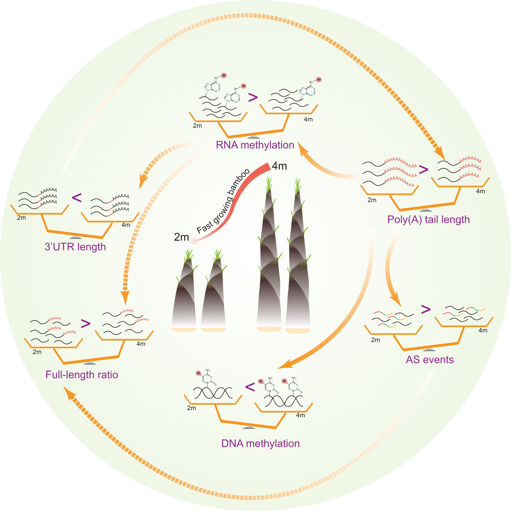
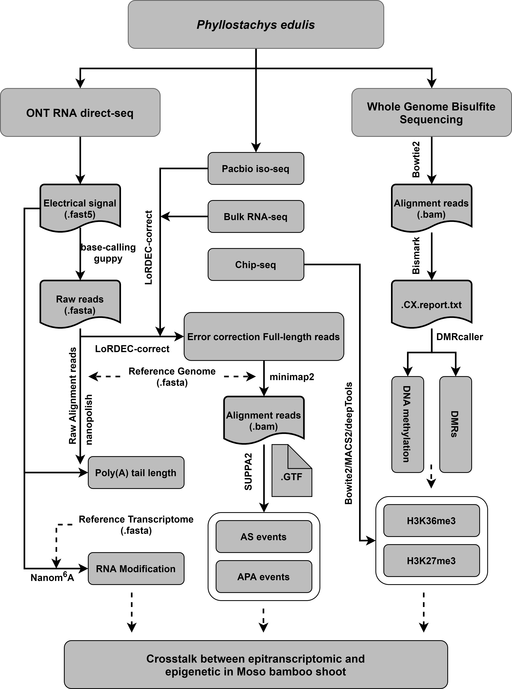

## Comprehensive profiling of epigenetic modifications in fast-growing Moso bamboo shoots

[](https://doi.org/10.1093/plphys/kiac525)

Moso bamboo, one of the fastest-growing plants on the planet, is an ideal model for the study of rapid plant growth. In this study, we used multiple approaches to uncover the complex transcriptome dynamics of bamboo shoots during rapid growth and the connections among the various underlying epigenetic mechanisms.

We proposed model for the interaction among DNA/RNA methylation, PAL, AS, full-length transcript rates, and 3′ UTR length associated with fast growth in bamboo shoots. AS, alternative splicing; 3′ UTR, 3′ untranslated region.

<div style="text-align: center">

</div>

## Requirements and Create Python environment
[](https://jupyter.org/) [](https://pypi.org/project/numpy/) [](https://pypi.org/project/pandas/) [](https://pypi.org/project/matplotlib/) [](https://pypi.org/project/seaborn/) [](https://pypi.org/project/scikit-learn/) [](https://pypi.org/project/scipy/) [](https://pypi.org/project/pysam/) [](https://pypi.org/project/joblib/) [](https://pypi.org/project/tqdm/) [](https://pypi.org/project/venn/) [](https://pypi.org/project/upsetplot/)

This repository is for the scripts and pipeline for analysing the Nanopore DRS, PacBio Iso-Seq, WGBS and RNA-seq for the fast growth bamboo shoot. It mainly contains jupyter notebook, python script, shell script and some intermediate files.

<div style="text-align: center">

</div>

### Create and activate conda environment

For main.ipynb notebook scrippt, the python version need is over 3.7. In order to avoid various package dependencies and version errors. It is recommended to use the following command to create a new conda environment for running notebook scripts.

```bash
# pysam only works on linux and osx-64
conda env create -n bamboo_drs --file environment.yml
conda activate bamboo_drs
```

## Scripts and datas

### Script usage

- **main.ipynb** All analysis and plotting scripts, in jupyter notebook format.
- **reads_coverage.py** Program to statistics of read coverage.
- **reads_statistics.py** Program to statistics of read length.
- **run_nanopore_v1.sh** Shell pipeline for processing DRS data.
- **run_rna_seq.sh** Shell pipeline for processing bulk RNAseq data.

### Intermediate file
- **all_TPM.csv** The tpm expression matrix of all samples.
- **all_row_count.csv** The read-count expression matrix of all samples.
- **phe_\*_ratio_df.csv** m6a modification information.
- **phe_shoot_\*_rep1_polya_info.csv** Poly(A) tail length information.


## Getting help
If you have any questions, please contact Tao Li at litao1503@outlook.com, or leave an [Issue](https://github.com/litao1503/Analysis_script_for_fast_growing_bamboo_shoot_datasets/issues).

## References
Li, Tao, et al. [Comprehensive profiling of epigenetic modifications in fast-growing Moso bamboo shoots](https://doi.org/10.1093/plphys/kiac525). Plant Physiology 191.2 (2023): 1017-1035.